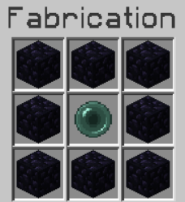

# 💀 Mode Hardcore

> **Version serveur : 1.7.10**  
> Mode compétitif et équilibré dans une map limitée, avec traque, primes et classement.

---

## 🎯 Présentation

Le mode Hardcore de **Mineria** propose :

- **Monde** limité
- **Spawn** sécurisé et protégé
- **Nether** accessible via **un item spécial**
- **PVP** stratégique et régulé
- **Farming** optimisé
- **Chasse aux joueurs** via **boussole** + **primes**
- **Classement** (kills, survie, temps de jeu)
- **Loots aléatoires** pour dynamiser l’exploration

---

## 1) 🌍 Overworld

- **Taille :** `3000 × 3000`  
- **Spawn central :** `x:0, z:0`
- **Zone spawn protégée :** `100 × 100` (**claim**)
  - Jump avec **table d’enchantement** au sommet
  - **Dégâts de chute désactivés** dans cette zone
- **Spawn aléatoire :**
  - À la **première connexion**
  - **Après chaque mort**

---

## 2) 🔥 Nether

- **Taille :** `1000 × 1000`
- **Accès :** via **création d’un item spécial**
  - Obtenu par **lot de 2** 
  - **Utilisation unique**
  - **Recette :**

    

**Restrictions :**
- **5 s de compte à rebours** avant téléportation
- **Impossible d’utiliser** si **boussole active** (*sauf depuis le Nether*)
- **Bloqué en combat**

**Téléportations aléatoires :**
- À l’**entrée** dans le Nether
- Au **retour** dans l’Overworld  
  ➜ **Message global** à **l’entrée** et à la **sortie**

**Divers :**
- **Portails classiques désactivés**
- **1 verrue du Nether** obtenue après **20 min** de connexion **continue** dans le Nether

---

## 3) ⚔️ PVP

### ⛏️ Nouveaux minerais & comparaisons

> `*` **Aria** n’est **pas disponible** pour cette saison Hardcore.

| Minerai  | Dégâts | Points d’armure | % dégâts bloqués |
|----------|:------:|:---------------:|:----------------:|
| Diamond  | 3.0    | 18              | 72 %             |
| Sapphire | 5.0    | 20              | 80 %             |
| Emerald  | 7.0    | 22              | 88 %             |
| Aria*    | 9.0    | 23              | 92 %             |

### 🚫 Désactivations

- **Potion de Force II**
- **Potion de Dégâts II**
- **Enchantement Frappe II**
- **Enchantement Recul II**

### ⏱️ Cooldowns

- **Golden Apple :** `2 min 30`  
  ➜ Affichage du **temps restant** en main
- **Enderpearl :** `10 s`  
  ➜ Affichage du **temps restant** en main

### 🎯 Effets de kill

- **Speed III** pendant **1 min**
- **Éclair sonore global**

### ⏳ Temps de ban à la mort

En cas de mort, un bannissement temporaire est appliqué en fonction du grade :

| Grade     | Durée du ban |
|-----------|--------------|
| Guerrier  | 12 h         |
| VIP       | 10 h         |
| SuperVIP  | 8 h          |
| Héros     | 6 h          |

---

## 4) ⛏️ Farming & XP

- **Saphir** générés **dans tous les biomes**
- **Émeraude** générés en biome **Extreme Hills**
- **/bottlexp** : taxe 10 %
- **Niveau requis :**
  - **15** lvl (*Guerrier*)
  - **10** lvl (*Grade premium*)
- **Enchantements** en **version 1.8**
- **Aucune suppression d’entités** via clear lag
- **MobStacker**, afin d’éviter les chutes de FPS.

---

## 5) 🧭 Boussole de Traque

- **Donnée** à la **première connexion**

**Cooldown :**
- **20 s** (*Guerrier*)
- **10 s** (*Grades premium*)

**Cycle d’activation :**
- **12 min désactivée** → **8 min activée** (boucle)
- **Dans le Nether :** **toujours active**
- **Portée :** **500 blocs** (*Pour tout les grades*)
- **Pas de `/friends`**

### 💎 Émeraude magique

- Rend le joueur **invisible aux boussoles ennemies**
- **Utilisable uniquement** pendant **l’activation** de la boussole
- **Durée :** le **temps restant** de l’activation en cours
- **Utilisation unique**
- **Obtention** (après avoir tué un joueur) :
  - **10 %** (*Guerrier*)
  - **20 %** (*VIP*)
  - **30 %** (*SuperVIP*)
  - **40 %** (*Héros*)

---

## 6) 🏆 Classement

- **+40 pts** par **kill**
- **−40 pts** par **mort**
- **+3 pts** toutes les **20 min** de **connexion continue**

```mcfunction
/playtime   # Affiche le temps de jeu + compteur avant les +3 pts
```

**Accès :**
- **Site externe** `https://mineria.fr/hardcore`
- **En jeu :** `/classement`

---

## 7) 🎁 Coffres à Loot

- **Spawn aléatoire** sur la map
- **Conditions :**
  - **Minimum 10 joueurs** connectés
  - À **10 joueurs** : **40 %** de chance **toutes les heures**
  - **Spawn uniquement en surface**
- **Message global :**  
  > « **Un coffre est apparu sur la map !** Coordonnées : `xxxxx xxxxx` »
- **Ouverture possible** **15 min** après apparition

### 📦 Table des loots

| Loot                          | % de chance |
|------------------------------|:-----------:|
| 6 EnderPearls                | 60 %        |
| 1 Émeraude magique           | 100 %       |
| 2 Livres Protection IV       | 20 %        |
| 1 Livre Tranchant V          | 30 %        |
| 1 Livre Flamme I             | 25 %        |
| 1 Livre Aura de Feu II       | 15 %        |
| 1 Livre Solidité III         | 18 %        |
| 1 **Pomme Cheat**            | 10 %        |
| 10 Émeraudes                 | 80 %        |
| 2 Potions de Régénération I ?| 15 %        |
| 1 Œuf de villageois          | 5 %         |

---

## 8) 💰 Prime sur la Tête

- Chaque **kill** ➜ **prime 1 h** sur la tête (**cumulable**)
- Le **temps de prime ne diminue pas** si le joueur est **seul** sur le serveur
- Si un **joueur avec prime** meurt, ça **compte double** dans le classement :
  - **Tueur :** **+80 pts**
  - **Victime :** **−80 pts**

```mcfunction
/wanted  # alias : /prime, /bounty
```

---

## ⭐ Avantages Grade Héros

```mcfunction
/craft
/feed
/enderchest   # (désactivé en combat)
/repair       # (cooldown : 6 h, désactivé en combat)
/uncondense   # blocs -> lingots
/condense     # minerais -> blocs
/furnace      # cuisson instantanée (minerais + nourriture)
```

---
